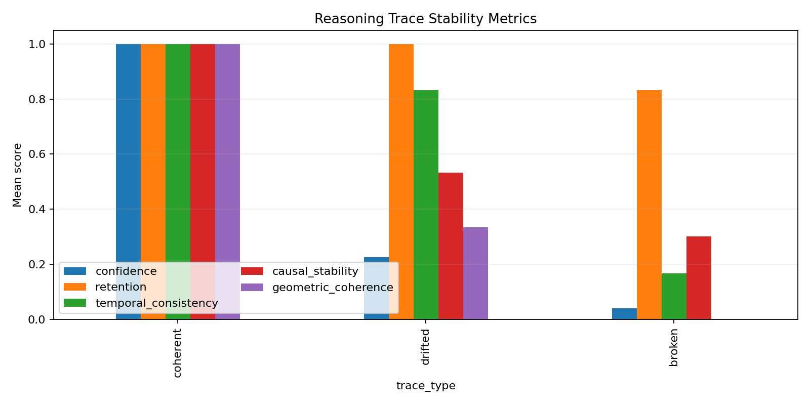

# Stability Oracle

Structural Stability Evaluation Layer for HAOS-IIP


Stability Oracle is a bounded evaluation surface for one operational question:

Given a state and a perturbation, does meaningful structure remain recoverably coherent?

The project is designed to make HAOS-IIP stability signals usable without entangling the research core with the application layer. The standalone skill layer treats HAOS-IIP as an external dependency and exposes a fast, deterministic interface for agents, demos, and downstream tooling.

Current anchor:

This demo shows that the oracle can detect structural reasoning drift using only trajectory geometry.

## What This Repo Contains

- frozen research-facing oracle surfaces already present in the repository
- a standalone application-layer package in [`haos-stability-skill/`](./haos-stability-skill/)
- structural state contracts, metric interfaces, and a deterministic classification policy
- public documentation assets and diagrams in [`Images/`](./Images/)

## Quick Links

- [Standalone Skill Package](./haos-stability-skill/)
- [Current Demo Dataset](./stability_oracle_demo/data/reasoning_demo_traces.json)
- [Current Demo Results](./stability_oracle_demo/output/results.csv)
- [Current Demo Explanations](./stability_oracle_demo/output/trace_explanations.json)
- [Concept Document](./haos-stability-skill/docs/WHAT_IS_STABILITY_ORACLE.md)
- [Numbered Documentation Paper (PDF)](./Images/01%20Stability%20Oracle%20Documentation%20Paper.pdf)
- [Oracle Engine v2 And Routing Paper (PDF)](./Images/02%20Oracle%20Engine%20v2%20and%20Deterministic%20Routing%20Paper.pdf)
- [Telemetry Layer And HAOS Parity Bridge Paper (PDF)](./Images/03%20Telemetry%20Layer%20And%20HAOS%20Parity%20Bridge%20Paper.pdf)
- [LLM Reasoning Telemetry Demo Paper (PDF)](./Images/04%20LLM%20Reasoning%20Telemetry%20Demo%20Paper.pdf)
- [LLM Reasoning Demo Freeze Marker](./stability_oracle_demo/DEMO_V1_FROZEN.md)
- [Overview PDF](./Images/Stability_Oracle.pdf)
- [Oracle Paradigm Reference (PDF)](./Images/The_Oracle_Paradigm.pdf)
- [GitHub Pages Source](./docs/)

## Current Demo

The current public proof surface is the deterministic LLM reasoning telemetry demo in [`stability_oracle_demo/`](./stability_oracle_demo/).

- dataset: 12 traces
- telemetry width: 8 dimensions
- expected bands: coherent -> stable, drifted -> marginal, broken -> unstable
- interpretability artifact: `trace_explanations.json`
- freeze marker: [`DEMO_V1_FROZEN.md`](./stability_oracle_demo/DEMO_V1_FROZEN.md)



Open the main demo artifacts:

- [Demo Paper (PDF)](./Images/04%20LLM%20Reasoning%20Telemetry%20Demo%20Paper.pdf)
- [Demo Note](./stability_oracle_demo/docs/DEMO_DOMAIN_LLM_REASONING.md)
- [Results CSV](./stability_oracle_demo/output/results.csv)
- [Trace Explanations JSON](./stability_oracle_demo/output/trace_explanations.json)

## Current Architecture

- agent layer: planning runtime or tool-calling system
- tool interface layer: CLI and JSON schema
- skill logic layer: bounded reports and summaries
- oracle policy layer: deterministic classification
- adapter layer: external HAOS bridge
- external dependency: frozen HAOS-IIP evaluation surface

## Output Contract

`evaluate_structure(...)` returns a compact machine-readable report:

```json
{
  "classification": "stable",
  "structural_retention": 0.94,
  "temporal_consistency": 0.98,
  "causal_deformation": 0.12,
  "geometric_integrity": 0.96,
  "confidence": 0.82,
  "coherence_score": 0.94,
  "policy_version": "v1_floor_mean_band",
  "summary": "Structure is stable with high retention and low deformation."
}
```

## Design Guarantees

- deterministic evaluation
- bounded JSON output
- read-only with respect to research artifacts
- no filesystem writes by default
- hard timeout enforcement
- fail-closed behavior under malformed inputs or adapter failures

## Status

The invariant language layer, metric interface, classification policy, Oracle Engine v2, and deterministic routing layer are now in place. The repository can expose HAOS-style structural stability as an agent-callable skill while keeping the research core separate from the application layer.

## Next

- expand the public Pages surface with benchmark and integration notes
- keep `PHYSICAL` and `FOUNDATIONAL` routing surfaces as bounded stubs until explicit implementations exist
- continue growing the standalone package without modifying frozen research code
